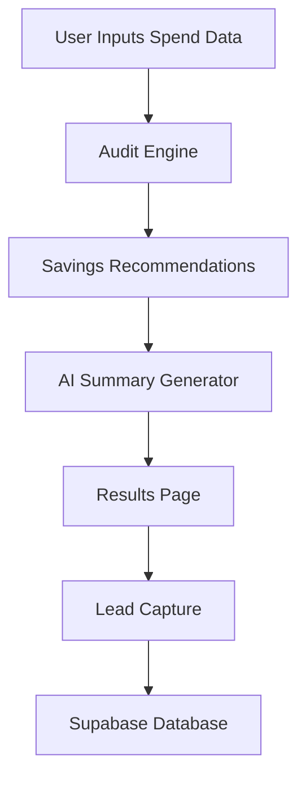

# Architecture

## Stack Choices

### Frontend
- React + Vite
- Tailwind CSS
- React Router

### Backend
- Node.js
- Express

### Database
- Supabase

## Frontend Architecture

The frontend uses a modular React component architecture with centralized state management inside the audit workflow.

### Key Components

- `ToolSelector` — dynamically selects AI tools for analysis
- `ToolCard` — reusable spend input card for each AI tool
- `AuditForm` — parent state container for audit data and persistence

### Persistence Layer

Audit sessions are persisted using browser localStorage to ensure form state survives page refreshes without requiring authentication.

### AI
- Anthropic API for personalized audit summaries

---

## System Flow

---

## Why React + JavaScript

I chose React with JavaScript to optimize for fast iteration and rapid UI development within the limited assignment timeline. Since the project emphasizes shipping velocity, UX polish, and product thinking, JavaScript allowed quicker prototyping while still maintaining modular architecture and reusable components.